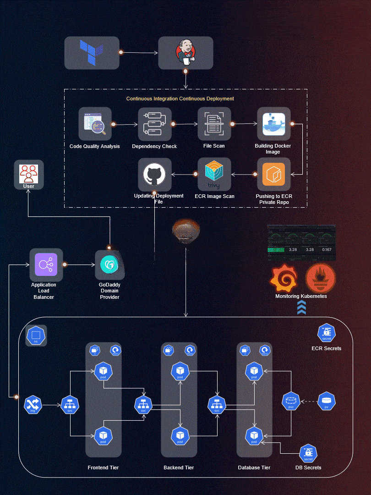

# End-to-End DevSecOps Kubernetes Three-Tier Project



## 🚀 Project Overview

Welcome to the End-to-End DevSecOps Kubernetes Project guide! In this comprehensive project, we will walk through the process of setting up a robust Three-Tier architecture on AWS using Kubernetes, DevOps best practices, and security measures. This project aims to provide hands-on experience in deploying, securing, and monitoring a scalable application environment.

###  Key Features

- **Infrastructure as Code (IaC)** using Terraform
- **Containerization** with Docker and Amazon ECR
- **CI/CD Pipeline** with Jenkins
- **GitOps** deployment using ArgoCD
- **Security Scanning** with SonarQube and Trivy
- **Container Orchestration** with Amazon EKS
- **Monitoring & Observability** using Prometheus and Grafana
- **Load Balancing** with AWS Application Load Balancer
- **Data Persistence** with Kubernetes Persistent Volumes


##  Table of Contents

- [Architecture](#architecture)
- [Prerequisites](#prerequisites)
- [Technology Stack](#technology-stack)
- [Project Setup](#project-setup)
  - [Step 1: IAM User Setup](#step-1-iam-user-setup)
  - [Step 2: Install Terraform & AWS CLI](#step-2-install-terraform--aws-cli)
  - [Step 3: Deploy Jenkins Server](#step-3-deploy-jenkins-server)
  - [Step 4: Configure Jenkins](#step-4-configure-jenkins)
  - [Step 5: Deploy EKS Cluster](#step-5-deploy-eks-cluster)
  - [Step 6: Configure Load Balancer](#step-6-configure-load-balancer)
  - [Step 7: Create ECR Repositories](#step-7-create-ecr-repositories)
  - [Step 8: Install & Configure ArgoCD](#step-8-install--configure-argocd)
  - [Step 9: Configure SonarQube](#step-9-configure-sonarqube)
  - [Step 10: Setup Monitoring](#step-10-setup-monitoring)
  - [Step 11: Deploy Three-Tier Application](#step-11-deploy-three-tier-application)
- [Cleanup](#cleanup)
- [Troubleshooting](#troubleshooting)
- [Contributing](#contributing)
- [License](#license)

---

## 🏗️ AWS EC2 Architecture


---

##  Prerequisites

Before starting this project, ensure you have:

- **AWS Account** with appropriate permissions
- **Local Machine** with:
  - Terraform installed
  - AWS CLI configured
  - Git installed
  - Basic understanding of:
    - Kubernetes & Docker
    - Jenkins & CI/CD concepts
    - DevOps principles
- **Domain Name** (optional, for custom DNS)
- **GitHub Account** with Personal Access Token

---

## 🛠️ Technology Stack

| Category | Tools |
|----------|-------|
| **Cloud Provider** | AWS (EKS, EC2, ECR, ALB, IAM) |
| **IaC** | Terraform |
| **Container Orchestration** | Kubernetes (Amazon EKS) |
| **CI/CD** | Jenkins |
| **GitOps** | ArgoCD |
| **Container Registry** | Amazon ECR |
| **Security Scanning** | SonarQube, Trivy, OWASP Dependency Check |
| **Monitoring** | Prometheus, Grafana, Helm |
| **Load Balancing** | AWS Application Load Balancer |
| **Version Control** | Git, GitHub |

---

##  Project Setup

### Step 1: IAM User Setup

Create an IAM user with necessary permissions for AWS resource management.

1. Navigate to **AWS IAM Console** → **Users**
2. Click **Create user**
3. Enter username and click **Next**
4. Select **Attach policies directly** → Search for **AdministratorAccess** → Click **Next**
5. Click **Create user**
6. Select user → **Security credentials** → **Create access key**
7. Select **Command Line Interface (CLI)** → Confirm → **Next**
8. Add description → **Create access key**
9. **Download credentials** (CSV file) and store securely
   
   
---

### Step 2: Install Terraform & AWS CLI

Install and configure Terraform and AWS CLI on your local machine.

#### Install Terraform

```bash
wget -O- https://apt.releases.hashicorp.com/gpg | sudo gpg --dearmor -o /usr/share/keyrings/hashicorp-archive-keyring.gpg
echo "deb [signed-by=/usr/share/keyrings/hashicorp-archive-keyring.gpg] https://apt.releases.hashicorp.com $(lsb_release -cs) main" | sudo tee /etc/apt/sources.list.d/hashicorp.list
sudo apt update
sudo apt install terraform -y
```

#### Install AWS CLI

```bash
curl "https://awscli.amazonaws.com/awscli-exe-linux-x86_64.zip" -o "awscliv2.zip"
sudo apt install unzip -y
unzip awscliv2.zip
sudo ./aws/install
```

#### Configure Terraform

Edit the environment file:

```bash
sudo vim /etc/environment
```

Add your AWS credentials:


**Note:** Restart your machine after configuration.

#### Configure AWS CLI

```bash
aws configure
```

Enter your AWS credentials:


---

### Step 3: Deploy Jenkins Server

Deploy Jenkins server on AWS EC2 using Terraform.

1. **Clone the repository:**

```bash
git clone https://github.com/AmanPathak-DevOps/End-to-End-Kubernetes-Three-Tier-DevSecOps-Project
cd End-to-End-Kubernetes-Three-Tier-DevSecOps-Project/Jenkins-Server-TF
```

2. **Update `backend.tf`** with your S3 bucket and DynamoDB table names:


3. **Update PEM file name** in the configuration:

4. **Initialize Terraform:**

```bash
terraform init
```


5. **Validate configuration:**

```bash
terraform validate
```


6. **Review plan:**

```bash
terraform plan -var-file=variables.tfvars
```


7. **Apply configuration:**

```bash
terraform apply -var-file=variables.tfvars --auto-approve
```

8. **Connect to Jenkins server:**


---

### Step 4: Configure Jenkins

Verify installed tools and configure Jenkins.

#### Verify Installations

```bash
jenkins --version
docker --version
docker ps
terraform --version
kubectl version
aws --version
trivy --version
eksctl --version
```

#### Access Jenkins

Navigate to `http://<Jenkins-Public-IP>:8080`


#### Install Suggested Plugins

#### Setup Admin User

#### Jenkins Dashboard


---

### Step 5: Deploy EKS Cluster

Configure AWS credentials in Jenkins and deploy EKS cluster.

#### Configure AWS in Jenkins

Navigate to **Manage Jenkins** → **Plugins**

Install required plugins:
- AWS Credentials
- Pipeline: AWS Steps


Restart Jenkins after installation:

#### Add AWS Credentials

**Manage Jenkins** → **Credentials** → **Global**

Add AWS credentials:


Add GitHub credentials (Personal Access Token):

All credentials:


#### Create EKS Cluster

```bash
eksctl create cluster --name Three-Tier-K8s-EKS-Cluster --region us-east-1 --node-type t2.medium --nodes-min 2 --nodes-max 2
aws eks update-kubeconfig --region us-east-1 --name Three-Tier-K8s-EKS-Cluster
```


#### Verify Nodes

```bash
kubectl get nodes
```


---

### Step 6: Configure Load Balancer

Setup AWS Load Balancer Controller for the EKS cluster.

#### Download IAM Policy

```bash
curl -O https://raw.githubusercontent.com/kubernetes-sigs/aws-load-balancer-controller/v2.5.4/docs/install/iam_policy.json
```

#### Create IAM Policy

```bash
aws iam create-policy --policy-name AWSLoadBalancerControllerIAMPolicy --policy-document file://iam_policy.json
```


#### Create OIDC Provider

```bash
eksctl utils associate-iam-oidc-provider --region=us-east-1 --cluster=Three-Tier-K8s-EKS-Cluster --approve
```

#### Create Service Account

```bash
eksctl create iamserviceaccount --cluster=Three-Tier-K8s-EKS-Cluster --namespace=kube-system --name=aws-load-balancer-controller --role-name AmazonEKSLoadBalancerControllerRole --attach-policy-arn=arn:aws:iam::<your_account_id>:policy/AWSLoadBalancerControllerIAMPolicy --approve --region=us-east-1
```


#### Deploy AWS Load Balancer Controller

```bash
sudo snap install helm --classic
helm repo add eks https://aws.github.io/eks-charts
helm repo update eks
helm install aws-load-balancer-controller eks/aws-load-balancer-controller -n kube-system --set clusterName=Three-Tier-K8s-EKS-Cluster --set serviceAccount.create=false --set serviceAccount.name=aws-load-balancer-controller
```

#### Verify Deployment

```bash
kubectl get deployment -n kube-system aws-load-balancer-controller
```


---

### Step 7: Create ECR Repositories

Create private ECR repositories for frontend and backend images.

#### Create Frontend Repository & Backend Repository

Click **Create repository**
Select **Private** → Enter repository name

#### View Repositories


---

### Step 8: Install & Configure ArgoCD

Setup ArgoCD for GitOps-based deployment.

#### Create Namespace

```bash
kubectl create namespace three-tier
```

#### Create ECR Secret

```bash
kubectl create secret generic ecr-registry-secret \
  --from-file=.dockerconfigjson=${HOME}/.docker/config.json \
  --type=kubernetes.io/dockerconfigjson --namespace three-tier
kubectl get secrets -n three-tier
```

#### Install ArgoCD

```bash
kubectl create namespace argocd
kubectl apply -n argocd -f https://raw.githubusercontent.com/argoproj/argo-cd/v2.4.7/manifests/install.yaml
```


#### Verify ArgoCD Pods

```bash
kubectl get pods -n argocd
```

#### Expose ArgoCD Server

```bash
kubectl patch svc argocd-server -n argocd -p '{"spec": {"type": "LoadBalancer"}}'
```

#### Access ArgoCD UI

#### Get ArgoCD Password

```bash
sudo apt install jq -y
export ARGOCD_SERVER='kubectl get svc argocd-server -n argocd -o json | jq --raw-output '.status.loadBalancer.ingress[0].hostname''
export ARGO_PWD='kubectl -n argocd get secret argocd-initial-admin-secret -o jsonpath="{.data.password}" | base64 -d'
echo $ARGO_PWD
```

Login with username `admin` and the password:

#### ArgoCD Dashboard


---

### Step 9: Configure SonarQube

Setup SonarQube for code quality analysis.

#### Access SonarQube

Navigate to `http://<Jenkins-Public-IP>:9000`

Login with `admin/admin`:

#### Generate Token

**Administration** → **Security** → **Users** → **Update tokens**


#### Configure Webhook

**Administration** → **Configuration** → **Webhooks** → **Create**


Enter details:
```
URL: http://<jenkins-server-public-ip>:8080/sonarqube-webhook/
```


#### Create Frontend Project

Click **Manually**
Enter project details
Select **Locally**
Use existing token
Select **Other** and **Linux**:


#### Create Backend Project


#### Add SonarQube Credentials to Jenkins

**Dashboard** → **Manage Jenkins** → **Credentials**


#### All Credentials


---

### Step 10: Setup Monitoring

Configure Helm, Prometheus, and Grafana for monitoring.

#### Install Required Jenkins Plugins

**Dashboard** → **Manage Jenkins** → **Plugins** → **Available Plugins**

Install:
- Docker
- Docker Commons
- Docker Pipeline
- Docker API
- docker-build-step
- Eclipse Temurin installer
- NodeJS
- OWASP Dependency-Check
- SonarQube Scanner


#### Configure Tools

**Dashboard** → **Manage Jenkins** → **Tools**

**Configure JDK**
**Configure SonarQube Scanner**
**Configure NodeJS**
**Configure OWASP Dependency Check**
**Configure Docker**

#### Configure SonarQube Server

**Dashboard** → **Manage Jenkins** → **System** → **SonarQube installations**

#### Add Prometheus Repo

```bash
helm repo add stable https://charts.helm.sh/stable
```

#### Install Prometheus & Grafana

```bash
helm repo add prometheus-community https://prometheus-community.github.io/helm-charts
helm install prometheus prometheus-community/prometheus
helm repo add grafana https://grafana.github.io/helm-charts
helm repo update
helm install grafana grafana/grafana
```

#### Check Services

```bash
kubectl get svc
```

#### Expose Services

Edit Prometheus service:

```bash
kubectl edit svc stable-kube-prometheus-sta-prometheus
```

Change type to LoadBalancer:

Edit Grafana service:

```bash
kubectl edit svc stable-grafana
```

#### Verify LoadBalancers

```bash
kubectl get svc
```

#### Access Prometheus

Navigate to `<Prometheus-LB-DNS>:9090`


#### Access Grafana

Navigate to Grafana LoadBalancer DNS

Login: `admin` / `prom-operator`


#### Configure Data Source

Click **Data Source**
Select **Prometheus**
Add Prometheus URL
Save and test

#### Import Dashboard

Click **Dashboard** → **New** → **Import**

Enter dashboard ID `6417`
Select data source
View Kubernetes metrics
---

### Step 11: Deploy Three-Tier Application

Deploy the application using Jenkins and ArgoCD.

#### Create Backend Pipeline

**Dashboard** → **New Item**

Add Jenkinsfile:

```groovy

// https://github.com/AmanPathak-DevOps/End-to-End-Kubernetes-Three-Tier-DevSecOps-Project/blob/master/Jenkins-Pipeline-Code/Jenkinsfile-Backend
```

#### Build Backend Pipeline

Click **Build Now**:


#### Create Frontend Pipeline

Add Jenkinsfile:

```groovy

// https://github.com/AmanPathak-DevOps/End-to-End-Kubernetes-Three-Tier-DevSecOps-Project/blob/master/Jenkins-Pipeline-Code/Jenkinsfile-Frontend
```
#### Build Frontend Pipeline


#### Configure Private Repository in ArgoCD

**Settings** → **Repositories** → **CONNECT REPO USING HTTPS**


#### Deploy Database Application

Click **CREATE APPLICATION**:


Enter database details:


#### Deploy Backend Application


#### Deploy Frontend Application


#### Deploy Ingress Application


#### Configure DNS

#### Access Application

Navigate to your subdomain:


Test functionality:


#### Monitor with Grafana


#### View ArgoCD Deployments

Database deployment:

![Database Deployment]

---

##  Cleanup

To avoid unnecessary AWS charges, clean up all resources:

### Delete EKS Cluster

```bash
eksctl delete cluster --name Three-Tier-K8s-EKS-Cluster --region us-east-1
```

### Delete ECR Repositories

```bash
aws ecr delete-repository --repository-name frontend --region us-east-1 --force
aws ecr delete-repository --repository-name backend --region us-east-1 --force
```

### Destroy Jenkins Infrastructure

```bash
cd Jenkins-Server-TF
terraform destroy -var-file=variables.tfvars --auto-approve
```

### Delete IAM Resources

- Delete IAM policies
- Delete IAM roles
- Delete IAM user and access keys

---

## 🔧 Troubleshooting

### Common Issues and Solutions

#### Issue 1: Load Balancer Controller Pods in CrashLoopBackOff

**Solution:**
```bash
helm upgrade -i aws-load-balancer-controller eks/aws-load-balancer-controller \
  --set clusterName=Three-Tier-K8s-EKS-Cluster \
  --set serviceAccount.create=false \
  --set serviceAccount.name=aws-load-balancer-controller \
  --set region=us-east-1 \
  --set vpcId=<your-vpc-id> \
  -n kube-system
```

#### Issue 2: ECR Login Failed

**Solution:**
```bash
aws ecr get-login-password --region us-east-1 | docker login --username AWS --password-stdin <account-id>.dkr.ecr.us-east-1.amazonaws.com
```

#### Issue 3: Jenkins Pipeline Fails

**Solution:**
- Verify all credentials are properly configured
- Check AWS permissions
- Ensure ECR repositories exist
- Validate Jenkinsfile syntax

#### Issue 4: ArgoCD Application Not Syncing

**Solution:**
- Verify repository connection
- Check manifest file paths
- Ensure namespace exists
- Review ArgoCD logs: `kubectl logs -n argocd <argocd-server-pod>`

---

##  Contributing

Contributions are welcome! Please follow these steps:

1. Fork the repository
2. Create a feature branch (`git checkout -b feature/AmazingFeature`)
3. Commit your changes (`git commit -m 'Add some AmazingFeature'`)
4. Push to the branch (`git push origin feature/AmazingFeature`)
5. Open a Pull Request

---

## Project Milestones Checklist

Track your progress through the project:

### Phase 1: Infrastructure Setup
- [ ] AWS IAM user created with proper permissions
- [ ] Terraform and AWS CLI installed and configured
- [ ] Jenkins server deployed on EC2
- [ ] All required tools installed on Jenkins server

### Phase 2: Kubernetes Cluster
- [ ] EKS cluster created and running
- [ ] Nodes are healthy and ready
- [ ] kubectl configured for cluster access
- [ ] AWS Load Balancer Controller deployed

### Phase 3: Container Registry
- [ ] ECR repositories created (frontend & backend)
- [ ] ECR authentication configured
- [ ] Docker images can be pushed to ECR

### Phase 4: GitOps Setup
- [ ] ArgoCD installed and accessible
- [ ] Private Git repository connected
- [ ] ECR secret created in three-tier namespace
- [ ] ArgoCD admin password retrieved

### Phase 5: Security & Quality
- [ ] SonarQube configured and accessible
- [ ] SonarQube projects created (frontend & backend)
- [ ] Webhooks configured
- [ ] Jenkins credentials configured

### Phase 6: CI/CD Pipelines
- [ ] Jenkins plugins installed
- [ ] Tools configured in Jenkins
- [ ] Backend pipeline created and successful
- [ ] Frontend pipeline created and successful
- [ ] Images pushed to ECR repositories

### Phase 7: Monitoring
- [ ] Prometheus deployed
- [ ] Grafana deployed
- [ ] Data source configured in Grafana
- [ ] Kubernetes dashboard imported
- [ ] Metrics visible and accurate

### Phase 8: Application Deployment
- [ ] Database application deployed via ArgoCD
- [ ] Backend application deployed via ArgoCD
- [ ] Frontend application deployed via ArgoCD
- [ ] Ingress configured and LoadBalancer created
- [ ] DNS configured (if using custom domain)
- [ ] Application accessible and functional

### Phase 9: Testing & Validation
- [ ] Application CRUD operations working
- [ ] Data persistence verified
- [ ] Pod recovery tested
- [ ] Monitoring dashboards showing metrics
- [ ] Security scans completed

### Phase 10: Documentation
- [ ] README completed with all sections
- [ ] Screenshots captured and organized
- [ ] Architecture diagram created
- [ ] Troubleshooting section populated
- [ ] Repository pushed to GitHub

---

## Learning Outcomes

By completing this project, you will have hands-on experience with:

### DevOps Practices
- Infrastructure as Code (IaC) with Terraform
- Continuous Integration/Continuous Deployment (CI/CD)
- GitOps methodology with ArgoCD
- Container orchestration with Kubernetes

### Security (DevSecOps)
- Code quality analysis with SonarQube
- Vulnerability scanning with Trivy
- Dependency checking with OWASP
- Container image security best practices
- AWS IAM and security policies

### Cloud Native Technologies
- Kubernetes cluster management
- Container registry operations
- Load balancing strategies
- Service mesh concepts
- Persistent storage in Kubernetes

### Monitoring & Observability
- Metrics collection with Prometheus
- Visualization with Grafana
- Logging best practices
- Performance monitoring
- Resource utilization tracking

### AWS Services
- Elastic Kubernetes Service (EKS)
- Elastic Container Registry (ECR)
- Application Load Balancer (ALB)
- Identity and Access Management (IAM)
- Virtual Private Cloud (VPC)

---

## 📖 Glossary

| Term | Definition |
|------|------------|
| **ArgoCD** | GitOps continuous delivery tool for Kubernetes |
| **DevSecOps** | DevOps practices with integrated security |
| **EKS** | Amazon Elastic Kubernetes Service |
| **ECR** | Amazon Elastic Container Registry |
| **Helm** | Package manager for Kubernetes |
| **IaC** | Infrastructure as Code |
| **Ingress** | Kubernetes object that manages external access |
| **Jenkins** | Open-source automation server |
| **Kubectl** | Kubernetes command-line tool |
| **LoadBalancer** | Service that distributes network traffic |
| **Prometheus** | Monitoring and alerting toolkit |
| **SonarQube** | Code quality and security analysis platform |
| **Terraform** | Infrastructure as Code tool |
| **Three-Tier** | Architecture with presentation, logic, and data layers |

---
